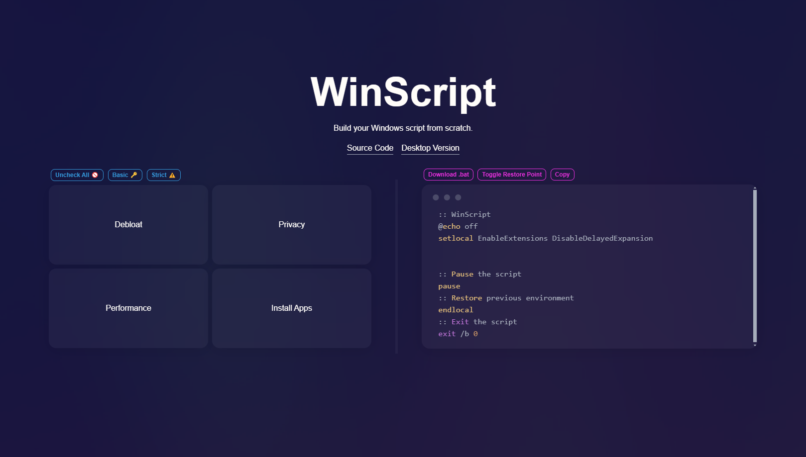

<h1 align="center">WinScript</h1>

<p align="center">WinScript is an open-source tool built to help you build custom scripts for Windows. It includes debloat, privacy, performance scripts & more, along with the ability to install all your favourite apps in one click.</p>



## Features

- 🧹 **Debloat**: Remove Windows bloatware, CoPilot, Edge, OneDrive & pre-installed features.
- 🔏 **Privacy**: Disable Windows and 3rd party telemetry & data collection, tracking, app access & more.
- 🚀 **Performance**: Set background services to manual to free resources, set your preferred DNS, clean temp files & more.
- ⬇️ **Install Apps**: Install all your favourite apps simultaneously in one click through chocolatey.

## Usage

**WinScript must be run as Administrator to function properly.**  
_The desktop app may be flagged as a threat by Windows Defender due to its ability to modify system settings. This is a false positive—WinScript is safe, transparent, and open-source._

🖥️ **Launch Command**:

```
irm "https://winscript.cc/irm" | iex
```

🖥️ **Via Winget**:

```
winget install winscript
```

📦 **Portable App**:
[Latest Release](https://github.com/flick9000/winscript/releases/latest)

🌍 **Online Version**:
[Website Link](https://winscript.cc/online)

## Support

### ⭐ Star

Feel free to leave a star and help the project reach more people!

### 👷 Contributing

Contributions are welcome! Fork the repository and create a pull request with your changes.

1. Fork the repository
2. Create your feature branch
3. Commit your changes
4. Push to the branch
5. Create a new Pull Request

### ☕ Donate

If you find this project helpful, consider supporting it by [buying me a coffee!](https://ko-fi.com/flick9000)

## License

📒 This project is licensed under the GPL v3 License. See the [LICENSE](LICENSE) file for more details.
