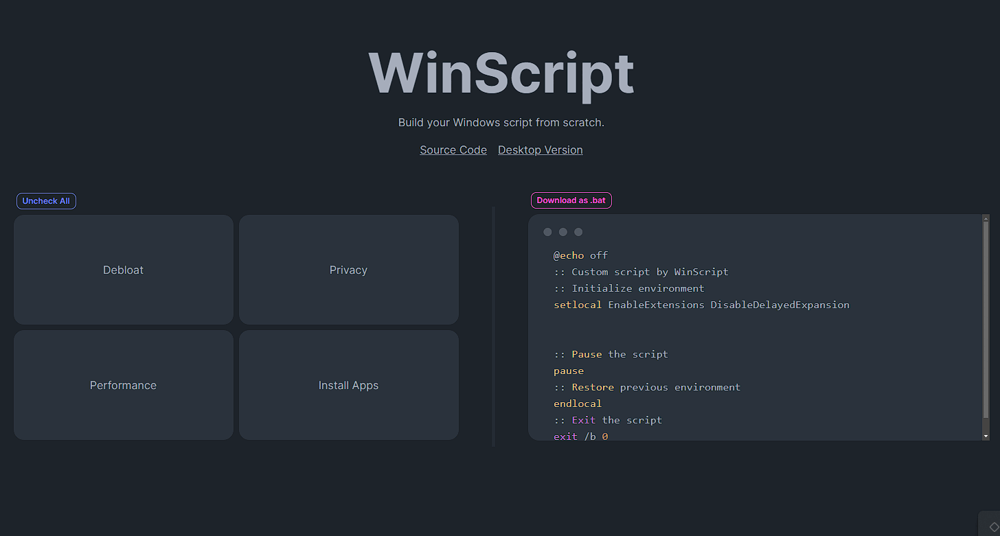

# WinScript

WinScript is a an open-source tool that allows you to build a Windows script from scratch. It features security, privacy, and performance tweaks, along with the ability to install applications through the terminal.

## Features

- 🧹 **Debloat**: Remove unnecessary bloatware to free up system resources.
- 🔏 **Privacy**: Protect your privacy by disabling telemetry & other settings.
- 🚀 **Performance**: Optimize your system for better performance.
- ⬇️ **Install Apps**: Easily install 3rd-party applications through chocolatey.

## Usage
-  🌍 Online: [Website](winscript.pages.dev)
-  💻 Offline: [Download](https://github.com/flick9000/winscript/releases)

## Support
### 👷 Contributing
Contributions are welcome! Please fork the repository and create a pull request with your changes.

1. Fork the repository
2. Create your feature branch
3. Commit your changes
4. Push to the branch
5. Create a new Pull Request
### ⭐ Star
Feel free to leave a star and help the project reach more people!

## License
📒 This project is licensed under the GPL v3 License. See the [LICENSE](LICENSE) file for more details.

