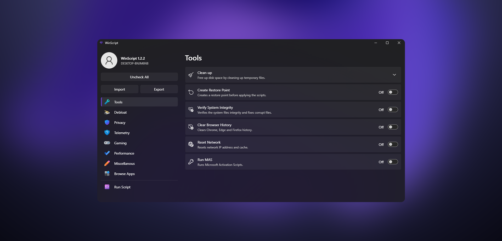

<h1 style="color: var(--cta);">WinScript</h1>

> WinScript is a powerful, simple to use & lightweight open-source tool designed to improve and customize your Windows experience. It offers a range of features, including debloating, privacy enhancement, performance optimization, and streamlined app installation.



## Features

### 🧹 Debloat

WinScript allows you to remove any pre-installed bloatware and unnecessary component from Windows. You can uninstall Microsoft Store, OneDrive, CoPilot, debloat or remove Microsoft Edge, disable Widgets & Taskbar Widgets, disable Windows Features such as Recall or Consumer Features & many more.

### 🔒 Privacy

You can disable app access to sensitive data, prevent background syncing of themes and passwords, and stop usage tracking like activity feeds, screen recording, and location-based services. The Telemetry section allows you to shut down Microsoft’s data collection of Windows, Office, updates, search, and feedback. You can disable 3rd-party apps data collection (Adobe, VS Code, Google, Nvidia etc), disable cloud-based speech recognition, DRM connectivity, and biometric services & much more.

### ⚡ Performance

You can enable the Ultimate Performance power plan, set background services to manual startup, reduce mouse input delays, and disable features like Superfetch, HAGS, Storage Sense, Windows Search Indexing, and Hibernation. It also allows you to fine-tune security settings for better performance by limiting Windows Defender’s CPU usage, disabling Core Isolation & more.

### 📦 App Installer

The Browse Apps section in WinScript makes it easy to bulk install all your essential software in just a few clicks. Choose from a list of popular apps—browsers, utilities, dev tools, media players, and more, and WinScript will generate a script to install them automatically using your preferred package manager: Chocolatey or Winget.

## Usage

> [!Warning]
> WinScript must be run as Administrator to function properly.

🖥️ **Launch Command**:

```
irm "https://winscript.cc/irm" | iex
```

🖥️ **Via Winget**:

```
winget install winscript
```

## Build

### 📋 Prerequisites

- NodeJS (LTS)

```
winget install --id OpenJS.NodeJS.LTS
```

- Rust & Cargo

```
winget install --id Rustlang.Rustup
```

### 🛠️ How to build

- Clone the repository

```
git clone https://github.com/flick9000/winscript.git
cd winscript/app
```

- Install dependencies

```
npm install
```

- Build the app

```
npm run tauri build
```

After building, the compiled executable will be available inside the src-tauri/target/release directory.

## Support

### 👷 Contributing

Contributions are welcome! Fork the repository and create a pull request with your changes.

1. Fork the repository
2. Create your feature branch
3. Commit your changes
4. Push to the branch
5. Create a new Pull Request

### ⭐ Star

Feel free to leave a star and help the project reach more people!

### ☕ Donate

If you find this project helpful, consider supporting it by [buying me a coffee!](https://ko-fi.com/flick9000)

## License

📒 This project is licensed under the GPL v3 License. See the [LICENSE](LICENSE) file for more details.
